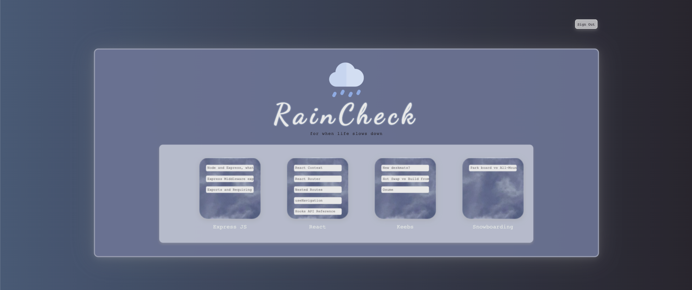
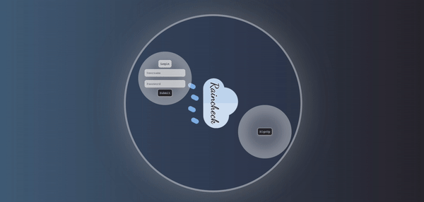
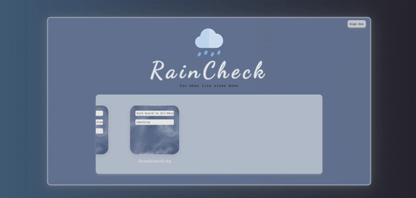

    
  <h1>Welcome to Raincheck</h1>
    <h3>Your go to resource tracking application</h3>
    
Save your articles, videos or any links in one place. Raincheck is an easy to use, all-in-one application that provides a simple GUI to keep track of everything you want to eventually get back to so that your tabs don't get cluttered.

  

  

